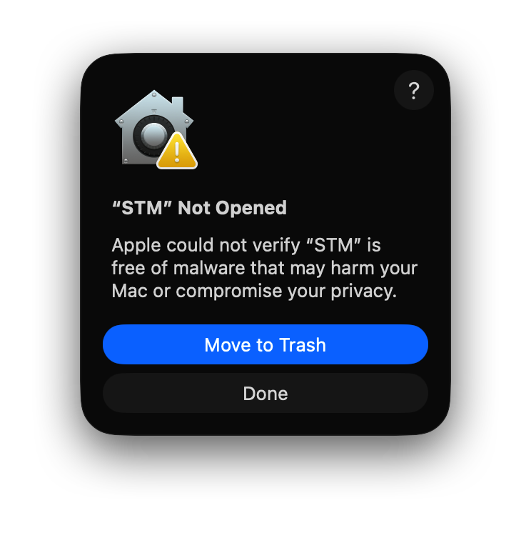
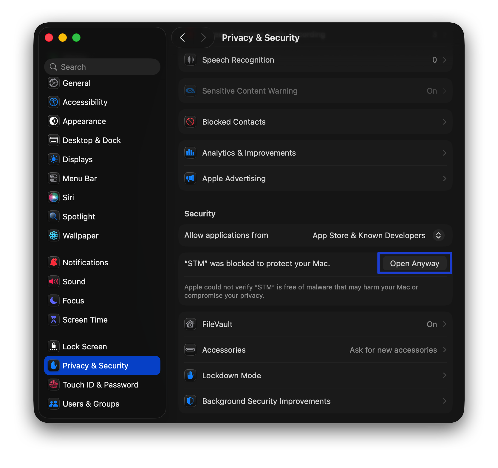

If you are using a macbook, after installing and running the app, you may encounter the following error:

Please do not worry, go to System Settings, Security & Privacy, scroll down, and then click "Open Anyway".

After that, the app should open without any issues.